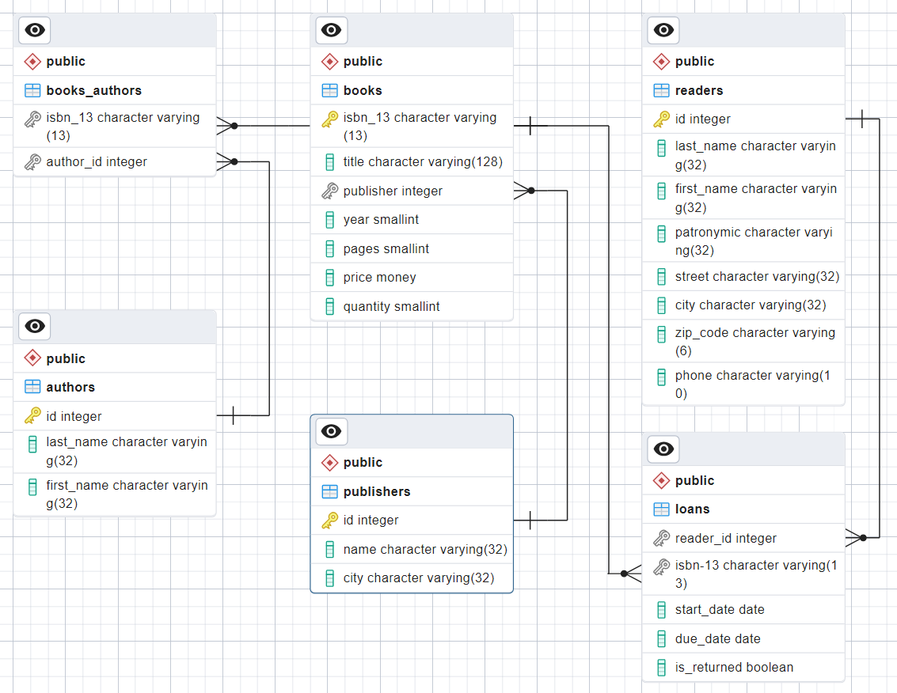

## Задание по теме 2.1 «Теория хранения данных. Реляционная модель данных»‎
Задание: Разработать логическую структуру БД для создания "Библиотеки".
### Сущности
В данной БД можно выделить 5 сущностей:
* читатели (`readers`)
* книги (`books`), причем каждая строка данной таблицы соответствует сразу всем экземплярам конкретной книги. Можно было ввести отдельную сущность - отдельный экземпляр книги - но с практической точки зрения это не нужно.
* авторы (`authors`)
* издательства (`publishers`)
* выдачи (`loans`).

Хотя автор(ы) являются обязательным атрибутом книги, их понадобилось вынести в отдельную сущность, т.к. у одной книги может быть несколько авторов. Издательства вынесены в отдельную сущность для сокращения избыточности. Также понадобилось ввести сущность «выдача»‎, чтобы связать читателей и выданные им книги.

### Связи и ключи
В данной БД можно выделить 3 связи:
1. Связь «один ко многим» *издательства - книги*. У книги только одно издательство, у издательства много книг. Первичный ключ `publishers.id` соответствует внешнему ключу `books.publisher`. 
2. Связь «многие ко многим» *книги - авторы*. У книги может быть несколько авторов, у автора - несколько книг. Для создания данной связи используется вспомогательная таблица `books_authors` с двумя внешними ключами, соответствующими первичным ключам в таблицах `books` и `authors`.
3. Связь «многие ко многим» *книги - читатели*. (Точнее было бы назвать эту связь *экземпляры - читатели*.) Для реализации данной связи используется дополнительная таблица `loans` с двумя внешними ключами, соответствующими первичным ключам в таблицах `books` и `readers`. Выдачи (`loans`) можно выделить в отдельную сущность со своими собственными атрибутами, такими как дата выдачи, требуемая дата возврата, флаг того, была ли возвращена книга. С использованием этих атрибутов можно, например, легко получить информацию о том, сколько экземпляров конкретной книги выдано.

