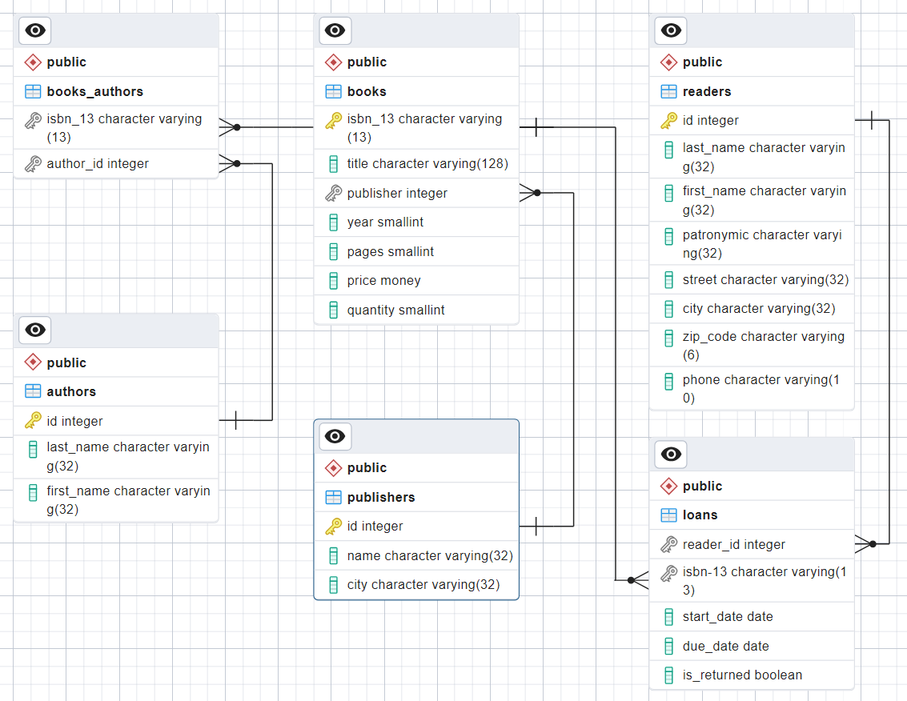
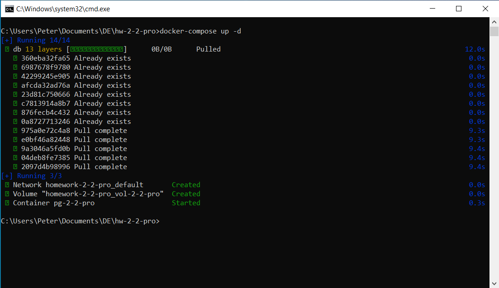
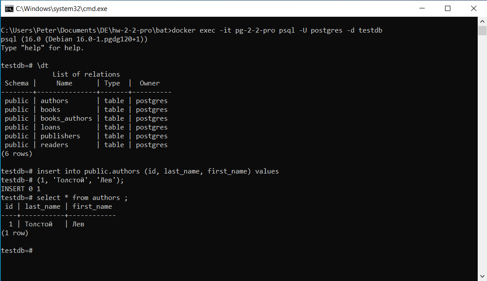

## Задание ПРО по теме 2.2 «Знакомство с реляционной СУБД Postgres. Введение в SQL»‎

Структура БД «Библиотека»‎:

SQL-cкрипт на создание таблиц находится в папке `pg_initdb.`

Сборка и запуск контейнера:

Контейнер в Docker Desktop:

Обращение к БД:

