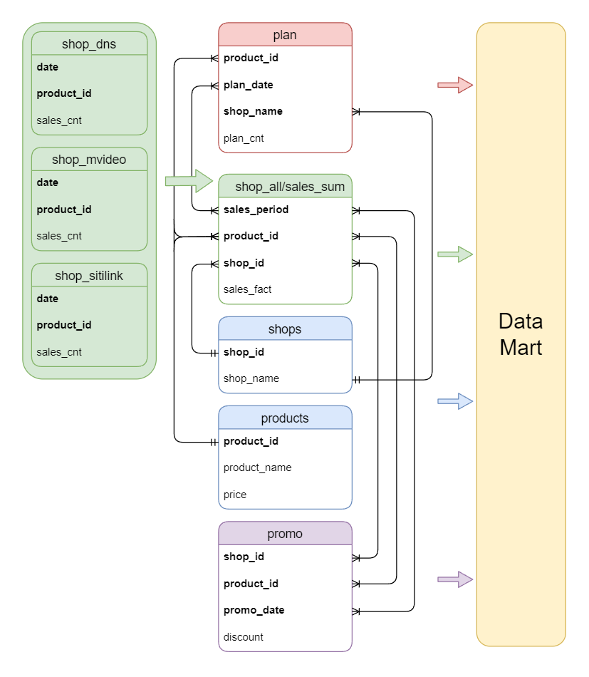

## Задание ПРО по теме 2.5 «DWH. Витрины данных»‎

При работе по сбору витрины для анализа эффективности плана продаж, к вам обратился ваш руководитель и сообщил, что надо обязательно к схеме данных добавить таблицу о промо-акциях на те или иные товары, иначе финальная витрина будет недостаточно информативной. 
Таким образом, в вашей схеме появляется новая таблица - promo, которая содержит информацию о том: в каком магазине, в какой день, на какой продукт и какого размера была скидка. 
Вам также нужно к итоговой витрине которую вы получили при выполнении базового задания, добавить несколько новых атрибутов:  

avg(sales/date) - среднее количество продаж в день,

max_sales - максимальное количество продаж за один день,

date_max_sales - день, в который произошло максимальное количество продаж,

date_max_sales_is_promo - факт того, действовала ли скидка в тот день, когда произошло максимальное количество продаж,

avg(sales/date) / max_sales - отношение среднего количества продаж к максимальному,

promo_len - количество дней месяце когда на товар действовала скидка,

promo_sales_cnt - количество товаров проданных в дни скидок,

promo_sales_cnt/fact_sales - отношение количества товаров проданных в дни скидки к общему количеству проданных товаров за месяц,

promo_income - доход с продаж в дни акций,

promo_income/fact_income - отношение дохода с продаж в дни акций к общему доходу с продаж за месяц

